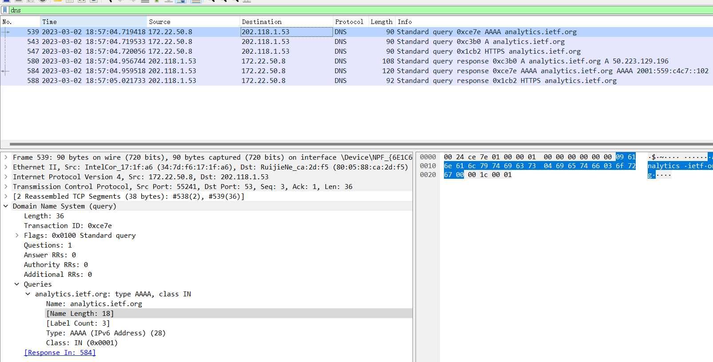
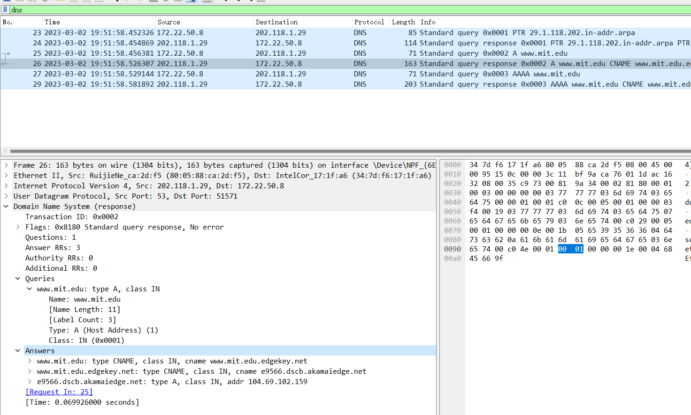

### 1. nslookup

1. 运行nslookup以获取一个亚洲的Web服务器的IP地址。该服务器的IP地址是什么？   
```
nslookup baidu.com

服务器:  dns1.neu.edu.cn
Address:  202.118.1.29

非权威应答:
名称:    baidu.com
Addresses:  110.242.68.66
          39.156.66.10
```

服务器的IP地址是110.242.68.66和39.156.66.10

2. 运行nslookup来确定一个欧洲的大学的权威DNS服务器。
```
nslookup -type=NS www.cam.ac.uk
服务器:  dns1.neu.edu.cn
Address:  202.118.1.29

cam.ac.uk
        primary name server = primary.dns.cam.ac.uk
        responsible mail addr = hostmaster.cam.ac.uk
        serial  = 1677746771
        refresh = 1800 (30 mins)
        retry   = 900 (15 mins)
        expire  = 604800 (7 days)
        default TTL = 3600 (1 hour)
```
权威DNS服务器
3. 运行nslookup，使用问题2中一个已获得的DNS服务器，来查询Yahoo!邮箱的邮件服务器。它的IP地址是什么？  
```
nslookup -type=MX yahoo.com primary.dns.cam.ac.uk
DNS request timed out.
    timeout was 2 seconds.
服务器:  UnKnown
Address:  2001:630:212:8::d:aa

DNS request timed out.
    timeout was 2 seconds.
DNS request timed out.
    timeout was 2 seconds.
*** 请求 UnKnown 超时

nslookup -type=MX yahoo.com 
服务器:  dns1.neu.edu.cn
Address:  202.118.1.29

非权威应答:
yahoo.com       MX preference = 1, mail exchanger = mta6.am0.yahoodns.net
yahoo.com       MX preference = 1, mail exchanger = mta7.am0.yahoodns.net
yahoo.com       MX preference = 1, mail exchanger = mta5.am0.yahoodns.net
```

### 2. ipconfig

没有题目  

### 3. 使用Wireshark追踪DNS

* 实验图像
  

4. 找到DNS查询和响应消息。它们是否通过UDP或TCP发送？  
通过TCP发送  

5. DNS查询消息的目标端口是什么？ DNS响应消息的源端口是什么？  
端口都是53
>
>DNS服务器间进行区域传输的时候用TCP 53，其他的时候如客户端查询DNS服务器时用 UDP 53
>dns有两个情况，一种是区域传输，一种是域名解析
> 
>1.区域传输时，一个区中主DNS服务器从自己本机的数据文件中读取该区的DNS数据信息，而辅助DNS服务器则从区的主DNS服务器中读取该区的DNS数据信息，传输协议是tcp。
>
>2.域名解析时一般返回的内容都不超过512字节，首选的通讯协议是udp。使用udp传输，不用经过TCP三次握手，这样DNS服务器负载更低，响应更快
> 
>3.当域名解析的反馈报文的长度超过512字节时，将不能使用udp协议进行解析，此时必须使用tcp。通常传统的UDP报文一般不会大于512字节。
区域传输使用TCP协议的原因大概是：
> 
>1） 区域传输的数据量相比单次DNS查询的数据量要大得多
> 
>2） 区域传输对数据的可靠性和准确性相比普通的DNS查询要要高得多，因此使用TCP协议。
>
>原文链接：https://blog.csdn.net/ljc1999/article/details/112392801

6. DNS查询消息发送到哪个IP地址？使用ipconfig来确定本地DNS服务器的IP地址。这两个IP地址是否相同？  
查询消息发送到202.118.1.53,包含在本地DNS服务器的IP地址中相同。

7. 检查DNS查询消息。DNS查询是什么"Type"的？查询消息是否包含任何"answers"？  
DNS查询的消息有Type A,  AAAA, HTTPS
查询消息不包含任何"answers"  

8. 检查DNS响应消息。提供了多少个"answers"？这些答案具体包含什么？  
Type A 和 AAAA分别提供了一个answers. answer分别如下：
```
analytics.ietf.org: type A, class IN, addr 50.223.129.196
    Name: analytics.ietf.org
    Type: A (Host Address) (1)
    Class: IN (0x0001)
    Time to live: 1800 (30 minutes)
    Data length: 4
    Address: 50.223.129.196


analytics.ietf.org: type AAAA, class IN, addr 2001:559:c4c7::102
   Name: analytics.ietf.org
   Type: AAAA (IPv6 Address) (28)
   Class: IN (0x0001)
   Time to live: 1800 (30 minutes)
   Data length: 16
   AAAA Address: 2001:559:c4c7::102
```

9. 考虑从您主机发送的后续TCP SYN数据包。 SYN数据包的目的IP地址是否与DNS响应消息中提供的任何IP地址相对应？  
后续TCP SYN数据包，发送向了DNS响应消息中提供的2001:559:c4c7::102, 50.223.129.196 

10. 这个网页包含一些图片。在获取每个图片前，您的主机是否都发出了新的DNS查询？  
并没有发出新的DNS查询  

11. DNS查询消息的目标端口是什么？ DNS响应消息的源端口是什么？  
端口都是53  

12. DNS查询消息的目标IP地址是什么？这是你的默认本地DNS服务器的IP地址吗？  
DNS查询消息的目标IP地址是202.228.1.29，是默认本地DNS服务器的IP地址  

13. 检查DNS查询消息。DNS查询是什么"Type"的？查询消息是否包含任何"answers"？  
Type PTR, A, AAAA, 查询消息不包含任何"answers"

14. 检查DNS响应消息。提供了多少个"answers"？这些答案包含什么？
Type A 的answers如下:
```
Answers
    www.mit.edu: type CNAME, class IN, cname www.mit.edu.edgekey.net
    www.mit.edu.edgekey.net: type CNAME, class IN, cname e9566.dscb.akamaiedge.net
    e9566.dscb.akamaiedge.net: type A, class IN, addr 104.69.102.159
```

15. 提供屏幕截图。  
实验图像  
  

16. DNS查询消息发送到的IP地址是什么？这是您的默认本地DNS服务器的IP地址吗？  
DNS查询消息的目标IP地址是10.5.5.1，是默认本地DNS服务器的IP地址  

17. 检查DNS查询消息。DNS查询是什么"Type"的？查询消息是否包含任何"answers"？  
Type NS 查询消息不包含任何"answers"  

18. 检查DNS响应消息。响应消息提供的MIT域名服务器是什么？此响应消息还提供了MIT域名服务器的IP地址吗？  
```
mit.edu nameserver = usw2.akam.net
mit.edu nameserver = use2.akam.net
mit.edu nameserver = asia1.akam.net
mit.edu nameserver = asia2.akam.net
mit.edu nameserver = ns1-173.akam.net
mit.edu nameserver = use5.akam.net
mit.edu nameserver = ns1-37.akam.net
mit.edu nameserver = eur5.akam.net
```
响应消息没有提供MIT域名服务器的IP地址  

19. 提供屏幕截图。
实验图像  
  

20. DNS查询消息发送到的IP地址是什么？这是您的默认本地DNS服务器的IP地址吗？如果不是，这个IP地址是什么？  
DNS查询消息先发送到默认本地DNS服务器10.5.5.1，查询bitsy.mit.edu的IP地址，查询消息再发送到IP地址18.0.72.3，是bitsy.mit.edu的IP地址。  

21. 检查DNS查询消息。DNS查询是什么"Type"的？查询消息是否包含任何"answers"？  
Type A 查询消息不包含任何"answers"  

22. 检查DNS响应消息。提供了多少个"answers"？这些答案包含什么？  
```
Answers
    www.aiit.or.kr: type A, class IN, addr 58.229.6.225
```

23. 提供屏幕截图。
实验图像  
  
